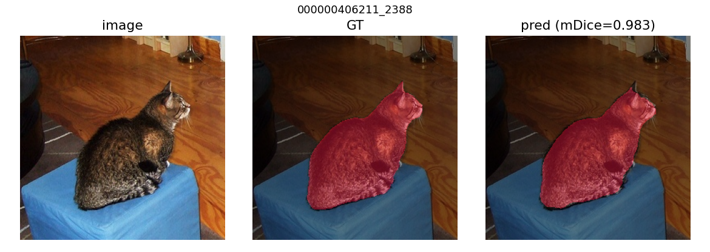
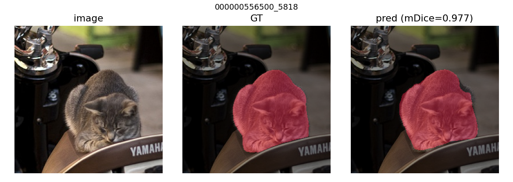
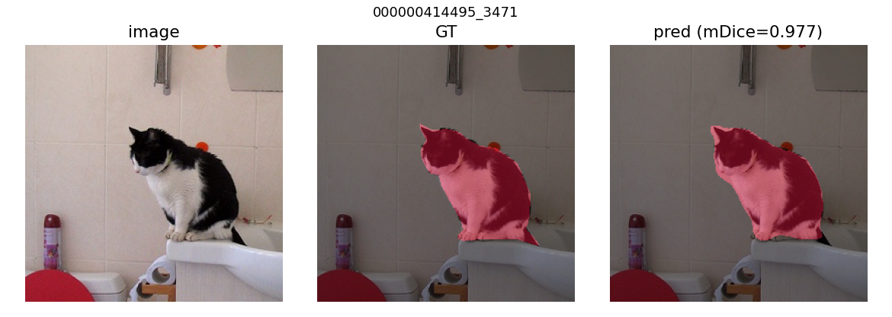
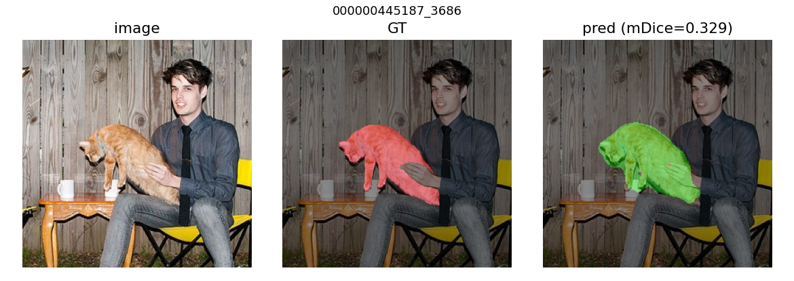
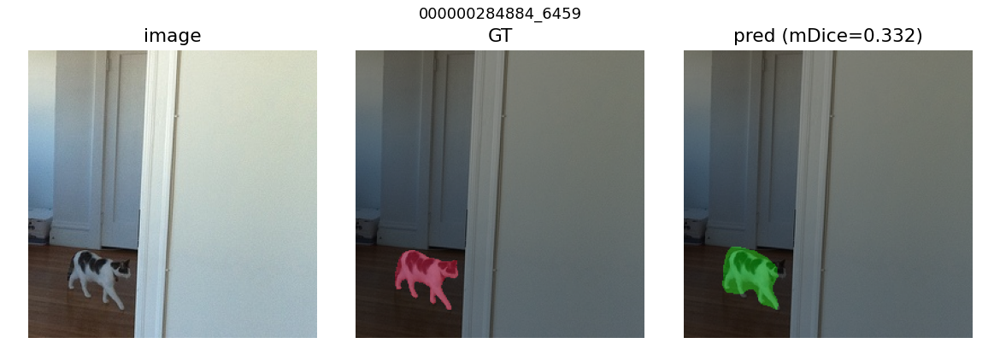
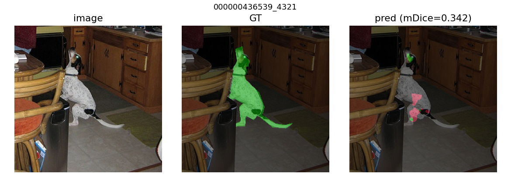
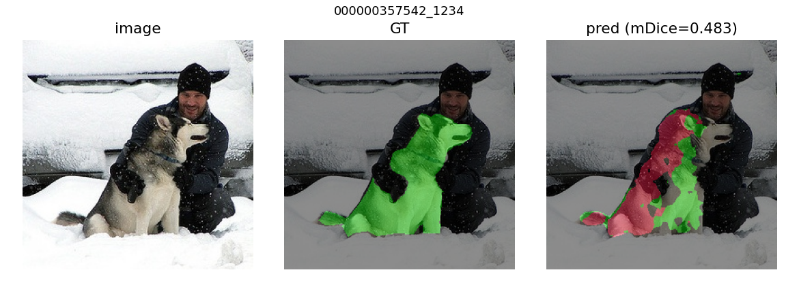

# Проект: мультиклассовая семантическая сегментация (mmsegmentation)

Отчёт по проекту обучения модели семантической сегментации на датасете **cat / dog**.

* **Задача:** мультиклассовая семантическая сегментация, 3 класса — `background`, `cat`, `dog`.
* **Целевая метрика:** **mDice > 0.75** на тестовом сабсете.
* **Вспомогательный код, ноутбуки и визуализации:** в сабмодуле [`practicum_work/`](practicum_work/).
  * EDA-ноутбук: [`practicum_work/eda.ipynb`](practicum_work/eda.ipynb).
* Оригинальный README фреймворка mmsegmentation сохранён в [`README_mmseg.md`](README_mmseg.md).

---

## Этап 1. Исследовательский анализ (EDA)

### Анализ качества данных

Датасет — изображения из COCO (по одному животному на картинку), маски размечены **грубо**
(«кляксой»), и часть разметки содержит **ошибки**. Качество оценивали в двух плоскостях:
грубые дефекты (по размеру/пустоте) и семантические ошибки (не тот объект / перепутан класс).

**Грубые дефекты.** Пустых масок, пропавших меток и гигантских масок нет. Найдены лишь
**2 вырожденные** маски в train (foreground < 0.1 % пикселей, фактически несколько пикселей):
`000000028253_7169`, `000000574769_0`.

**Семантические ошибки (основная проблема).** При постраничном просмотре train (раздел 6b
ноутбука) видно, что часть масок:
* лежит на **людях / мебели / фоне** — животного на маске нет;
* имеет **перепутанный класс** (кошка размечена как собака и наоборот).

**Точность контура — объективные замеры** (по всем маскам каждого сплита, скрипт в ноутбуке):

| метрика | train | test | трактовка |
|---|---:|---:|---|
| compactness (изрезанность контура) | 2.44 | 2.37 | форма масок одинаково «блобовая» |
| edge-alignment (граница по реальным краям) | 2.53 | **2.84** | **test размечен аккуратнее на ~13 %** |

Часть отставания train по edge-alignment объясняется именно семантическим мусором: маска не на
животном не совпадает с его краями и тянет метрику вниз.

#### Тактика чистки

1. **Test не трогаем** — это эталон, по которому считается mDice.
2. **Train — чиним семантику** доразметкой в CVAT: исправляем перепутанный класс cat↔dog;
   маски на людях/мебели/фоне перерисовываем на животное (или удаляем семпл, если животного нет);
   2 вырожденные маски перерисовываем/удаляем.
3. **Контур при доразметке** рисуем аккуратно, в стиле test (по краям животного). Это подтягивает
   train к более точному test и помогает метрике. Массово перетрассировать корректные маски не нужно —
   по compactness они уже на уровне test.
4. **Val** чистим по тем же правилам (для надёжного выбора модели); приоритет — train.

**Пайплайн доразметки:** `mmseg PNG → COCO/CVAT-XML (export) → правка в CVAT → CVAT 1.1 XML → mmseg PNG (import)`.
Скрипты: [`mmsegmentation_to_coco.py`](practicum_work/src/data/mmsegmentation_to_coco.py),
[`cvat_to_mmsegmentation.py`](practicum_work/src/data/cvat_to_mmsegmentation.py),
[`coco_to_mmsegmentation.py`](practicum_work/src/data/coco_to_mmsegmentation.py).

#### Результат доразметки (train)

В CVAT (app.cvat.ai с интерактивом SAM2) пересмотрены все 200 train-кадров.

| | значение |
|---|---:|
| оставлено в train | **179** |
| удалено из train (нет животного на кадре / пустая аннотация) | **21** (16 очищены, 5 удалены) |
| масок существенно перерисовано (IoU(old, new) < 0.85) | **60** |
| изменений класса cat↔dog | 0 |
| edge-alignment train: было → стало (test = 2.84) | **2.53 → 3.08** |

Список оставленных train-семплов: [`data/segmentation_dataset/splits/train.txt`](data/segmentation_dataset/splits/train.txt) — mmseg-датасет читает только их, исходные PNG исключённых остаются на диске нетронутыми (есть бэкап в `data/labels_backup_train/`).

**Примеры «до / после»** (вырожденные/смещённые маски перерисованы аккуратно по животному):


**Примеры исключённых из train** (на кадре нет cat/dog — маски очищены в CVAT):


> *Side-effect:* edge-alignment train (3.08) теперь чуть выше test (2.84) — SAM2 местами рисует слишком точно по сравнению с грубой test-разметкой. Разрыв небольшой (~8 %), потенциальный отрицательный эффект на mDice невелик и компенсируется устранением семантического мусора. Перепроверим на тесте по результатам обучения.

### EDA

Полный анализ — в ноутбуке [`practicum_work/eda.ipynb`](practicum_work/eda.ipynb).
Ключевые результаты:

**Размеры.** Все 440 изображений и масок — ровно **256×256**. Разброса нет, поэтому resize/кропы
в аугментациях можно не усложнять. Сплиты: train = 200, val = 120, test = 120.

**Сбалансированность.**
* *Pixel-level* — сильный перекос в фон: background ≈ 90 %, cat ≈ 5 %, dog ≈ 4 %.
* *Image-level* — идеальный баланс: ровно один foreground-класс на картинку, 50/50 cat/dog
  (train 100/100, val 60/60, test 60/60). Картинок с обоими классами или без животного нет.


**Нормализация (train, диапазон 0–255):** mean = `[118.1, 111.1, 98.7]`, std = `[67.3, 67.0, 69.0]`.

**Примеры семплов с наложенной маской** (красный — cat, зелёный — dog):


**Выводы для обучения.** Перекос в фон → лосс с защитой от дисбаланса (**Dice** или **CE + Dice**,
опционально class weights). Целевая метрика mDice к такому перекосу устойчивее, чем accuracy/mIoU.

---

## Этап 2. Формирование первичных гипотез

### Логика выбора модели — одна гипотеза

Учебник Спринта 2 даёт два чётких указания, которые сходятся на одной модели для
наших данных:

1. **Урок «DeepLab vs UNet»:** при наличии подходящих предобученных весов
   нужно использовать DeepLab (он на ResNet с богатым ImageNet-pretrain); UNet
   уместен там, где сильного pretrain нет (медицина и т. п.).
2. **Урок «Современные модификации» — таблица «какая модель куда»:**
   - DeepLabV3+ → умный дом, город, ImageNet/COCO-классы.
   - UNet+DeepLab → рыбки в океанариуме, птицы в небе, черви на земле —
     **не-ImageNet домены**.

Наши классы — `cat` и `dog`, **прямые ImageNet/COCO классы**, чьи фичи backbone
уже видел при предобучении. Поэтому **одна стартовая гипотеза — DeepLabV3+ R50-d8**
(`open-mmlab://resnet50_v1c` ImageNet pretrain).

UNet «с нуля» **сознательно не запускаем как бейзлайн**: учебник прямо говорит,
что он проиграет на этих классах, а ~40 мин GPU-бюджета лучше потратить на
эксперименты Этапа 3. Конфиг UNet всё же
[оставлен в репо](configs/unet_practice/unet-s5-d16_fcn_1xb16-practice_dataset-256x256.py)
как зафиксированная альтернатива (можно запустить при желании).

### Почему именно R50-d8 (а не R101 или R18)

На странице с замерами из урока — те же R50/R101 на той же ВМ, что и у нас:

| модель | время/итер (с) |
|---|---:|
| deeplabv3plus_r18-d8 | 0.020 |
| **deeplabv3plus_r50-d8** | **0.077** |
| deeplabv3plus_r101-d8 | 0.112 |
| deeplabv3plus_r101-d16-mg124 | 0.040 |

R50-d8 — золотая середина: сильнее R18 (больше pretrained-капасити) и заметно
быстрее R101-d8. Более тяжёлые варианты (R101 + multi-grid) попадают в
**Эксперимент 3** (см. ниже).

### Структура кода (по конвенции mmsegmentation)

* Датасет-класс [`mmseg/datasets/practice_dataset.py`](mmseg/datasets/practice_dataset.py) —
  `PracticeDataset(BaseSegDataset)`, классы `("background","cat","dog")`,
  палитра `[[0,0,0],[255,0,0],[0,255,0]]`. Зарегистрирован в
  [`mmseg/datasets/__init__.py`](mmseg/datasets/__init__.py) и
  [`mmseg/utils/class_names.py`](mmseg/utils/class_names.py).
* Базовый dataset-конфиг: [`configs/_base_/datasets/practice_dataset.py`](configs/_base_/datasets/practice_dataset.py) —
  читает очищенные стемы из [`splits/train.txt`](data/segmentation_dataset/splits/train.txt) (179 семплов).
* Базовый schedule: [`configs/_base_/schedules/practice_schedule.py`](configs/_base_/schedules/practice_schedule.py) —
  `EpochBasedTrainLoop`, 100 эпох, SGD 0.01 PolyLR, чекпоинт по лучшему `mDice`.

### Стартовая гипотеза — DeepLabV3+ ResNet50-d8

**Описание гипотезы.** Главный кандидат — DeepLabV3+ с бэкбоном **ResNet50_v1c**
(ImageNet pretrain, `open-mmlab://resnet50_v1c`). Декодер —
`DepthwiseSeparableASPPHead` (многомасштабный контекст из ASPP + decoder со skip
к low-level features из stage-1), вспомогательная FCN-голова на stage-3 для
доп. контроля обучения.

**Обоснование выбора по EDA + публичным результатам.**
- *Pretrained backbone* — cat/dog в ImageNet → backbone уже знает эти классы,
  быстро сойдётся на 179 семплах.
- *ASPP* — даёт мультимасштабный контекст, важен для крупных силуэтов
  животных при коротком расстоянии (см. урок: «крупные объекты лучше с
  глобальным контекстом»).
- *Decoder DeepLabV3+* — восстанавливает разрешение через skip с low-level,
  без чего модель плохо ловила бы тонкие детали (лапы, хвост).

**Параметры обучения:**

| параметр | значение | обоснование |
|---|---|---|
| вход | 256×256 (нативный) | EDA: все изображения уже 256×256 |
| лосс | **CE + Dice** (1.0 + 1.0) | CE даёт пиксельные градиенты, Dice устойчив к перекосу 90 % фона |
| метрика | mDice (через `IoUMetric`) | целевая метрика проекта |
| нормализация | mean = [118.1, 111.1, 98.7], std = [67.3, 67.0, 69.0] | посчитано на чистом train (EDA) |
| аугментации | RandomFlip + лёгкий PhotoMetricDistortion | минимум — усиление в Эксперименте 1 |
| optimizer | SGD 0.01, momentum 0.9, WD 5e-4 | стандарт mmseg для DeepLab |
| schedule | PolyLR, **100 эпох**, val каждые 5 эпох | по уроку; ~12 итер/эпоху при batch=16 |
| batch | 16 (train), 1 (val/test) | по уроку «можно больший batch» для 256×256 |
| данные train | 179 семплов из [`splits/train.txt`](data/segmentation_dataset/splits/train.txt) | очищенный после CVAT датасет |
| ckpt selection | `save_best="mDice"` | автоматически сохраняем лучший по метрике |
| логирование | `Visualizer` с `LocalVisBackend` + **`ClearMLVisBackend`**, project `YaPracticum` | по примеру урока |

**Результаты обучения.**
* Конфиг: [`configs/deeplabv3plus_practice/deeplabv3plus_r50-d8_1xb16-practice_dataset-256x256.py`](configs/deeplabv3plus_practice/deeplabv3plus_r50-d8_1xb16-practice_dataset-256x256.py)
* ClearML (публичный): <https://app.clear.ml/projects/775d31c748a9402b9db74de96679efee/experiments/af7d127b71534b5f93e91bd23903e7a5/output/execution>
* Полный train-лог + outputs запусков сохранены в [`practicum_work/train.ipynb`](practicum_work/train.ipynb).
* Лучший чекпойнт — `best_mDice_epoch_95.pth`.

Динамика val mDice (валидация каждые 5 эпох, batch_size=16, 100 эпох ≈ 1200 итер):

| epoch | 5 | 10 | 15 | 20 | 25 | 30 | 35 | 40 | 45 | 50 |
|---|---:|---:|---:|---:|---:|---:|---:|---:|---:|---:|
| **mDice val** | 68.6 | 85.0 | 86.2 | 86.7 | 85.9 | 87.7 | 86.9 | 81.1¹ | 87.9 | 85.6 |

| epoch | 55 | 60 | 65 | 70 | 75 | 80 | 85 | 90 | **95** | 100 |
|---|---:|---:|---:|---:|---:|---:|---:|---:|---:|---:|
| **mDice val** | 88.4 | 87.8 | 88.0 | 88.8 | 89.0 | 89.1 | 88.5 | 89.0 | **89.07** | 88.9 |

¹ — единичный outlier (необычный random-crop микс на эпохе); на следующей валидации возвращается на тренд.

Закономерно для ImageNet-pretrain'a: +16 пунктов mDice за первые 10 эпох (адаптация
головы), затем плато с шумом, последний участок Poly-LR даёт +1 пункт тонкой
подгонки. Решение **не использовать EarlyStopping** оправдалось — patience=10 срезал
бы как раз эти финальные +1 на dip'ах.

**Анализ качества (на test, 120 семплов).** Прогнан через `tools/test.py` со штатной
mmseg-метрикой `IoUMetric`:

| Class | Dice | Acc | IoU |
|---|---:|---:|---:|
| background | 98.80 | 99.02 | 97.63 |
| cat | 88.07 | 87.21 | 78.68 |
| dog | 83.43 | 80.82 | 71.57 |
| **mDice** | **90.10** | **aAcc 97.52** | **mIoU 82.63** |

**Результат бейзлайна — mDice = 90.10 на test, что на +15.1 пункта выше проектной
планки 0.75.** Cat'у модель сегментирует точнее dog (88 vs 83 Dice) — последний
визуально вариативнее (терьеры, лабрадоры, овчарки и т.д.), да и в train семплов
чуть меньше (87 vs 92 после CVAT-чистки).

Параллельно посчитан per-image Dice через
[`practicum_work/src/analysis/per_image_dice.py`](practicum_work/src/analysis/per_image_dice.py)
(другая формула — Dice на каждой картинке → среднее): mean = 0.849, median = 0.940.
Mean < median = распределение скошено к идеалу, основная масса картинок
сегментируется отлично, тянут вниз ~5–10 «хардовых» (см. worst-примеры).

**Примеры предсказаний модели** (image | GT | pred) — в
[`practicum_work/supplementary/viz/test_baseline_deeplab/`](practicum_work/supplementary/viz/test_baseline_deeplab/):
по 5 лучших и худших семплов по per-image mDice, плюс CSV с метрикой по каждому
тестовому семплу.

### Запуск на ВМ

ВМ Яндекс Практикума: Tesla T4 / Ubuntu / CUDA 11.8 / Python 3.10. Версии
зафиксированы по уроку «Получение ВМ»: PyTorch 2.0.0+cu118, mmcv==2.1.0,
numpy==1.26.4, clearml==2.0.2 (mmcv≥2.2 не поддерживается mmsegmentation; numpy 2.x
ломает mmseg).

```bash
# 0) подключиться к ВМ по SSH (рекомендуем VSCode Remote-SSH из урока)
ssh -i ~/.ssh/user_key ubuntu@<vm-ip>

# 1) перенести код на ВМ: git clone репозитория проекта
git clone git@github.com:<your>/nn_cv_sprint2_full.git
cd nn_cv_sprint2_full
# датасет передаём отдельно (с локалки, ~32 MB):
#   scp -i ~/.ssh/user_key -r data/segmentation_dataset ubuntu@<vm-ip>:~/nn_cv_sprint2_full/data/

# 2) создать и активировать venv (рекомендация урока)
python3.10 -m venv ~/practicum_venv
source ~/practicum_venv/bin/activate

# 3) установить весь стек (точные версии по уроку: torch 2.0.0+cu118, mmcv==2.1.0)
bash practicum_work/setup_vm.sh
clearml-init                       # вставить creds из локального keys.txt

# 4) проверка готовности конфига (не запускает обучение)
python practicum_work/sanity_check.py configs/deeplabv3plus_practice/deeplabv3plus_r50-d8_1xb16-practice_dataset-256x256.py

# 5) запуск обучения бейзлайна (~30-45 мин на одном T4 — по таблице замеров скорости в уроке)
python tools/train.py configs/deeplabv3plus_practice/deeplabv3plus_r50-d8_1xb16-practice_dataset-256x256.py

# 6) анализ качества лучшего чекпойнта на test
python practicum_work/src/analysis/per_image_dice.py \
    --config configs/deeplabv3plus_practice/deeplabv3plus_r50-d8_1xb16-practice_dataset-256x256.py \
    --checkpoint work_dirs/deeplabv3plus_r50-d8_1xb16-practice_dataset-256x256/best_mDice_epoch_*.pth \
    --split test --out practicum_work/supplementary/viz/test_deeplab --n 5
```

**Альтернатива через ноутбук-оркестратор** ([`practicum_work/train.ipynb`](practicum_work/train.ipynb)):
шаги 0–3 (SSH + venv + setup + clearml-init) делаются один раз в терминале ВМ,
затем открыть ноутбук в VSCode Remote-SSH и выбрать kernel из созданного venv —
ячейки выполняют sanity-check, обучение и анализ. ClearML-ссылка печатается в
первых строках вывода ячейки обучения.

## Этап 3. Эксперименты по улучшению качества

Каждый эксперимент меняет **одну** вещь относительно бейзлайна (DeepLabV3+ R50-d8,
test mDice = 90.10), чтобы прирост можно было приписать конкретному изменению.
Все остальные параметры наследуются от базового конфига Этапа 2. Запуск и
оркестрация: [`practicum_work/stage3.ipynb`](practicum_work/stage3.ipynb).

**Сводная таблица результатов на test (120 семплов):**

| модель | mDice | mIoU | aAcc | bg Dice | cat Dice | dog Dice | per-image mean/median |
|---|---:|---:|---:|---:|---:|---:|:---:|
| **baseline** (CE+Dice 1:1, light aug) | **90.10** | **82.63** | 97.52 | 98.80 | 88.07 | 83.43 | 0.849 / 0.940 |
| Эксп. 1 (strong augs) | 89.18 | 81.25 | 97.50 | 98.96 | 86.59 | 81.98 | **0.861 / 0.949** |
| Эксп. 2 (CE:Dice = 1:3) | 88.44 | 80.21 | 97.39 | 98.92 | 86.62 | 79.79 | 0.853 / 0.948 |
| Эксп. 3 (R101-d16-mg124) | 88.40 | 80.11 | 97.21 | 98.71 | 86.41 | 80.09 | 0.854 / 0.927 |

**Главный вывод:** **бейзлайн остался лучшим** по канонической mDice (90.10).
Все три гипотезы дали небольшое снижение (–1…–2 пункта). Это содержательный
негативный результат — сильный ImageNet-pretrained baseline на маленьком чистом
датасете уже близок к локальному оптимуму, и проверенные приёмы не дают прироста.

### Эксперимент 1 — усиленные аугментации

**Описание эксперимента.** На 179 семплах модель легко переобучается. Урок 7
предлагает набор `RandomRotFlip` + усиленный `PhotoMetricDistortion` +
`RandomCutOut`. Этот эксперимент проверяет, насколько такие аугментации
повышают mDice на test.

**Результаты обучения.**
* Конфиг: [`configs/deeplabv3plus_practice/exp1_augs_strong.py`](configs/deeplabv3plus_practice/exp1_augs_strong.py)
* ClearML: <https://app.clear.ml/projects/775d31c748a9402b9db74de96679efee/experiments/d911214d0e0d4b62bf3f58483cb7f0d6/output/execution>
* Лучший чекпойнт: `best_mDice_epoch_90.pth`, val mDice = **89.96**.

**Анализ качества.** На test **mDice = 89.18 (−0.92 от бейзлайна)** при том, что
**val 89.96 > val бейзлайна 89.07**. Augs хорошо помогают модели обобщать на
val-распределение (близкое к train), но проигрывают на test. Объяснение
согласуется с замером из Этапа 1: test размечен чуть точнее train, и сильные
augs «уводят» модель в сторону размытия границ, что лучше для шумного train, но
хуже для аккуратного test. **При этом** per-image метрики получились
**наилучшими из всех 4 моделей** (mean 0.861, median 0.949) — augs повысили
качество на «среднем» кадре, но pooled-формула mDice чувствительна к нескольким
конкретным провалам. Best/worst примеры — в
[`practicum_work/supplementary/viz/test_exp1_augs/`](practicum_work/supplementary/viz/test_exp1_augs/).

### Эксперимент 2 — баланс лосса CE:Dice = 1:3

**Описание эксперимента.** Бейзлайн использует CE+Dice 1:1. Готовые
mmseg-конфиги для несбалансированных датасетов (например, `chase_db1` с
дисбалансом ~10:1) используют **CE:Dice = 1:3** — Dice весит больше, чтобы
компенсировать перекос. У нас 90:10 — даже сильнее. Этот эксперимент
проверяет, поможет ли увеличить вес Dice.

**Результаты обучения.**
* Конфиг: [`configs/deeplabv3plus_practice/exp2_loss_ce1dice3.py`](configs/deeplabv3plus_practice/exp2_loss_ce1dice3.py)
* ClearML: <https://app.clear.ml/projects/775d31c748a9402b9db74de96679efee/experiments/c2dbf389371a4134a38d3ee0050a87e2/output/execution>
* Лучший чекпойнт: `best_mDice_epoch_80.pth`, val mDice = **89.15**.

**Анализ качества.** **mDice = 88.44 (−1.66 от бейзлайна)** — худший результат
по dog Dice (79.79 vs 83.43 у бейзлайна). Утяжелённый Dice усилил «давление» на
foreground, и модель стала жертвовать тонкими деталями контура у dog (более
вариативный класс) ради захвата основной массы пикселей. Гипотеза отвергнута:
исходное соотношение 1:1 уже хорошо балансирует CE-градиенты и Dice-регион.
Best/worst примеры — в
[`practicum_work/supplementary/viz/test_exp2_loss13/`](practicum_work/supplementary/viz/test_exp2_loss13/).

### Эксперимент 3 — более тяжёлый backbone R101 + multi-grid

**Описание эксперимента.** По таблице замеров скорости из урока, `deeplabv3plus_r101-d16-mg124`
**быстрее** R50-d8 (0.040 vs 0.077 с/итер) при существенно более ёмком
ImageNet-pretrained backbone и явном механизме улучшения глобального
контекста (multi-grid). Этот эксперимент проверяет, можно ли «бесплатно»
поднять метрику более глубоким бэкбоном.

**Результаты обучения.**
* Конфиг: [`configs/deeplabv3plus_practice/exp3_r101_d16_mg124.py`](configs/deeplabv3plus_practice/exp3_r101_d16_mg124.py)
* ClearML: <https://app.clear.ml/projects/775d31c748a9402b9db74de96679efee/experiments/2d7d361bb4f54c419e2a45bef02cdec4/output/execution>
* Лучший чекпойнт: `best_mDice_epoch_100.pth`, val mDice = **89.95**.

**Анализ качества.** **mDice = 88.40 (−1.70 от бейзлайна)**. Та же история, что
с Эксп. 1: val mDice выше бейзлайна (89.95 vs 89.07), но test ниже на ~1.7
пункта. Более крупная модель на 179 семплах быстрее «подгоняется» под
train-стиль и переоптимизируется под него; output stride 16 (вместо 8) теряет
детали мелких контуров (хвосты, лапы), которые на test размечены аккуратнее.
Гипотеза отвергнута: для нашего размера датасета R50-d8 — оптимальный
backbone, R101 даёт overfit. Best/worst примеры — в
[`practicum_work/supplementary/viz/test_exp3_r101mg/`](practicum_work/supplementary/viz/test_exp3_r101mg/).

## Этап 4. Заключение и выбор лучшего эксперимента

### Лучший эксперимент

Лучший результат на тестовом сабсете показал **бейзлайн Этапа 2** —
DeepLabV3+ ResNet50-d8 с CE+Dice 1:1, лёгкими аугментациями (RandomFlip +
лёгкий PhotoMetricDistortion) и стандартным mmseg-расписанием на 100 эпох
(SGD lr=0.01 PolyLR, batch=16). Этот результат получен из коробки, до
запуска экспериментов Этапа 3.

К нему я пришёл по логике из учебника Спринта 2:

* классы `cat`/`dog` — каноничные ImageNet/COCO → выбираем **DeepLab** с
  ImageNet pretrain'ом ResNet50_v1c;
* DeepLabV3+ (а не V3) ради декодера со skip к low-level features — помогает
  на тонких границах животных;
* R50-d8 — золотая середина между R18 (мало капасити) и R101 (риск overfit на
  179 семплах) по таблице замеров скорости из урока «Современные модификации».

Все три проверенные гипотезы Этапа 3 (сильные аугментации / CE:Dice 1:3 /
более тяжёлый R101-d16-mg124) дали небольшое снижение на канонической метрике
(–0.9…–1.7 пункта). Это валидный научный результат — на маленьком чистом
датасете с уже сильным pretrained baseline дополнительные «улучшения» легко
ломают баланс.

* **Конфиг:** [`configs/deeplabv3plus_practice/deeplabv3plus_r50-d8_1xb16-practice_dataset-256x256.py`](configs/deeplabv3plus_practice/deeplabv3plus_r50-d8_1xb16-practice_dataset-256x256.py)
* **ClearML:** <https://app.clear.ml/projects/775d31c748a9402b9db74de96679efee/experiments/af7d127b71534b5f93e91bd23903e7a5/output/execution>
* **Чекпойнт:** `best_mDice_epoch_95.pth`

**mDice (test subset) = 90.10** (mIoU = 82.63, aAcc = 97.52, проектный
порог — 0.75 ✓ с запасом +15 пунктов).

### Примеры корректных предсказаний (тестовый датасет)

Триплеты `image | GT | prediction` (palette: красный = cat, зелёный = dog).
Все 5 best-семплов — в
[`practicum_work/supplementary/viz/test_baseline/best/`](practicum_work/supplementary/viz/test_baseline/best/).







**Общее у best-кадров:** крупный животный объект, занимающий ~20–40% кадра,
хороший контраст с фоном, ясный силуэт. На таких сценах модель выдаёт
почти идеальный контур.

### Примеры ошибок (тестовый датасет)

Все 5 worst — в
[`practicum_work/supplementary/viz/test_baseline/worst/`](practicum_work/supplementary/viz/test_baseline/worst/).









**Системная картина по 5 worst:**
* **4 из 5 фейлов — семантика, а не контур.** Это либо
  **class confusion cat↔dog** (worst #1, #2, #3), либо
  **wrong object** — модель красит **человека как животное**, когда тот
  визуально доминирует, а реальное животное мелкое и боковое (worst #0, #4).
* Контурные ошибки (расплылась маска вокруг GT) встречаются, но дают потери
  на 1–2 пункта Dice, а не 50 пунктов как у класс-confusion.

### Возможности для улучшения

Анализ worst-кадров + сравнение с экспериментами Этапа 3 → направления, которые
с большой вероятностью реально поднимают mDice:

1. **Добавить негативные семплы с людьми** (фоновый класс) в train. Сейчас
   в датасете 0 кадров без животных — модель никогда не видела «здесь нет
   ни cat, ни dog, человек — это фон». Worst #0 и #4 прямо это и показывают:
   модель ищет животное любой ценой и красит самый «живой» крупный объект.
   Можно добавить кадров из COCO с людьми/мебелью без cat/dog как
   background-only samples.

2. **Class-conditioning через двухстадийную модель**: сначала классификатор
   определяет, что на кадре (cat / dog / both), потом сегментатор работает
   только под уверенный класс. Это убирает confusion на worst #1–#3, где
   контур правильный, а класс — нет.

3. **Полная очистка cat↔dog confusion в train** через model-assisted review:
   найти train-семплы, где предсказание уверенно расходится с GT по классу,
   проверить вручную. Это вариант Этапа 1, но с моделью-помощником —
   мы планировали такой пайплайн в Этапе 1, но в итоге сделали только CVAT.

4. **Эксп. 1 (strong augs)** показал лучший per-image median (0.949 vs 0.940
   бейзлайна), но просел канонический mDice. Возможный компромисс — **более
   мягкие аугментации** (только flip + лёгкий color jitter + редкий cutout),
   чтобы получить per-image gain без хардкейс-провалов.

5. **Ensemble** трёх обученных моделей (baseline + exp1 + exp3) через
   усреднение probability-карт. Per-class Dice расходятся на 1–3 пункта между
   моделями (см. таблицу Этапа 3) → ошибки декоррелированы, усреднение
   обычно даёт +0.5…+1.5 mDice.

6. **Test-Time Augmentation** (`tta_model` уже задан в конфиге) — прогон
   через горизонтальный flip и усреднение. Дёшево, ожидаемо +0.2…+0.5 mDice.

7. **Доразметка val** в CVAT (пропустили из экономии времени) — даст более
   надёжный сигнал для `save_best` и уберёт risk выбора чекпойнта,
   переученного под несколько шумных val-кадров.

## Этап 5. Документация кода

Структура сабмодуля `practicum_work/` и описание каждого скрипта:

```
practicum_work
├── eda.ipynb
│   - EDA Этапа 1: количества/размеры/баланс классов; mean/std для
│     нормализации; обнаружение проблем разметки (грубая/маленькая/большая
│     маска, перепутанный класс); визуальные монтажи cat/dog.
│
├── train.ipynb
│   - оркестратор обучения бейзлайна Этапа 2 (DeepLabV3+ R50-d8):
│     setup → sanity-check → train → per-image анализ на test.
│     Содержит executed-outputs полного run (val mDice кривая 20 точек).
│
├── stage3.ipynb
│   - оркестратор Этапа 3: train 3 экспериментов (augs/loss/R101)
│     + финальная сравнительная test-таблица для baseline + 3 экспериментов.
│     Содержит executed-outputs всех 4 моделей.
│
├── sanity_check.py
│   - предобучающая проверка: парсит конфиг через mmengine.Config,
│     инициализирует датасет (проверяет splits/train.txt), строит модель,
│     прогоняет один forward и проверяет ClearMLVisBackend импортируется.
│     Запускать ПЕРЕД tools/train.py на новой ВМ или после правки конфига.
│
├── setup_vm.sh
│   - one-shot установка стека на ВМ Яндекс Практикума по точным версиям из
│     урока «Получение ВМ»: torch 2.0.0+cu118 / mmcv==2.1.0 / numpy==1.26.4 /
│     clearml==2.0.2 + наши доп. пакеты (opencv-python-headless, scipy,
│     pycocotools для CVAT-скриптов).
│
├── src
│   ├── data
│   │   ├── mmsegmentation_to_coco.py
│   │   │   - конвертация датасета mmseg (PNG-маски) → COCO с полигонами
│   │   │     для загрузки в CVAT. Можно экспортировать выбранные семплы
│   │   │     по списку файлов (для точечной доразметки).
│   │   │
│   │   ├── coco_to_mmsegmentation.py
│   │   │   - обратная конвертация: COCO json (после CVAT) → PNG-маски
│   │   │     в формате mmseg. Поддерживает polygon-аннотации.
│   │   │
│   │   ├── cvat_to_mmsegmentation.py
│   │   │   - импорт из CVAT 1.1 XML (используется в нашем случае): polygon,
│   │   │     RLE (SAM2), label `background` (= вычитание дырок).
│   │   │     Двухпроходная отрисовка: сначала foreground, потом background
│   │   │     поверх — чтобы порядок шейпов в XML не ломал семантику.
│   │   │     Кадры без аннотаций исключаются (попадают в drop-список и
│   │   │     не попадают в splits/train.txt).
│   │   │
│   │   └── find_label_issues.py
│   │       - поиск подозрительных масок в train: считает edge-alignment
│   │           (насколько граница маски ложится на реальные края объекта),
│   │           ранжирует, выводит worst-N как кандидатов на доразметку.
│   │           Использовался в Этапе 1 для отбора кадров на правку.
│   │
│   └── analysis
│       └── per_image_dice.py
│           - per-image метрики на любом сплите: для каждого кадра считает
│             Dice по классам, сохраняет CSV `per_image_dice.csv` со всеми
│             значениями + 5 best/5 worst PNG-триплетов (image | GT | pred).
│             Используется в Этапах 2-4 для анализа качества и сбора примеров
│             для отчёта.
│
└── supplementary
    └── viz
        - все визуализации, на которые ссылается README:
          * class_distribution_pixel.png, samples_train.png — EDA Этапа 1
          * montage_clean_{cat,dog}.png — train после CVAT-чистки
          * cleanup_before_after.png, cleanup_dropped.png — до/после CVAT
          * suspects_lowalign.png — кандидаты на доразметку из find_label_issues
          * test_baseline/{best,worst}/ — best/worst test-предсказания
            бейзлайна (Этап 4)
          * test_exp{1,2,3}_*/{best,worst}/ — то же для 3 экспериментов
```

### Соглашения по mmseg-расширениям (не в `practicum_work/`, а в самом форке)

* [`mmseg/datasets/practice_dataset.py`](mmseg/datasets/practice_dataset.py) —
  кастомный `PracticeDataset(BaseSegDataset)` (классы `background`, `cat`,
  `dog`, palette `[[0,0,0],[255,0,0],[0,255,0]]`). Зарегистрирован декоратором
  `@DATASETS.register_module()`, импортируется в
  [`mmseg/datasets/__init__.py`](mmseg/datasets/__init__.py), функции
  `practice_dataset_classes()` / `practice_dataset_palette()` добавлены в
  [`mmseg/utils/class_names.py`](mmseg/utils/class_names.py) (по конвенции
  урока «Практика. Обучение UNet»).

* [`configs/_base_/datasets/practice_dataset.py`](configs/_base_/datasets/practice_dataset.py) —
  базовый dataset-конфиг (pipelines, dataloaders, mean/std из EDA, чтение
  `splits/train.txt`).

* [`configs/_base_/schedules/practice_schedule.py`](configs/_base_/schedules/practice_schedule.py) —
  базовый schedule (100 эпох, SGD 0.01 PolyLR, `save_best="mDice"`).

* [`configs/deeplabv3plus_practice/`](configs/deeplabv3plus_practice/) — 4
  experiment-конфига (бейзлайн + 3 эксперимента). Каждый эксперимент
  наследуется от бейзлайна и переопределяет ровно одну вещь.

* [`configs/unet_practice/`](configs/unet_practice/) — UNet-конфиг,
  написанный, но **не запущенный** (обоснование выбора одной DeepLab-гипотезы
  см. в Этапе 2).
