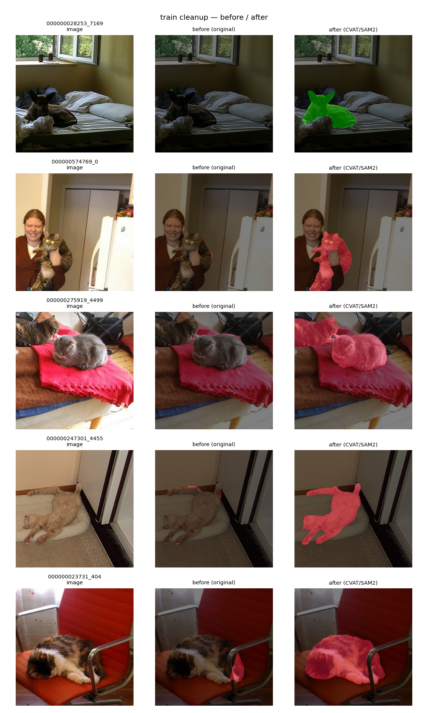
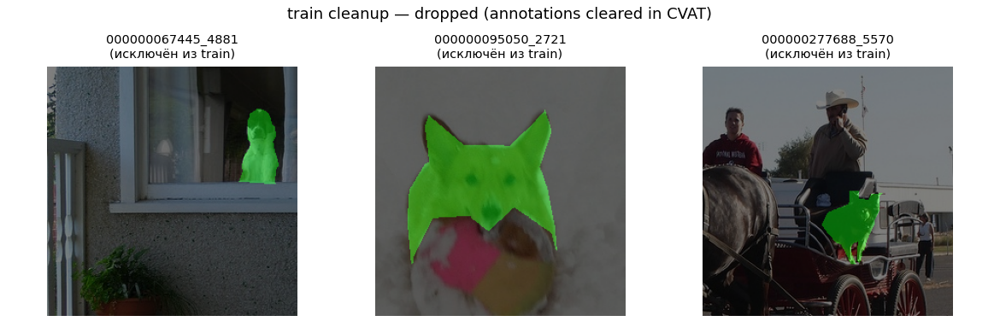
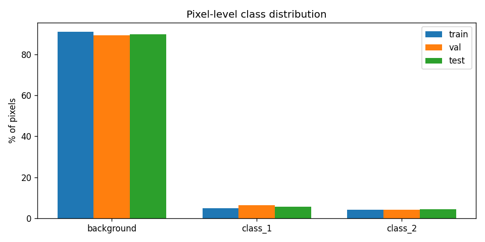
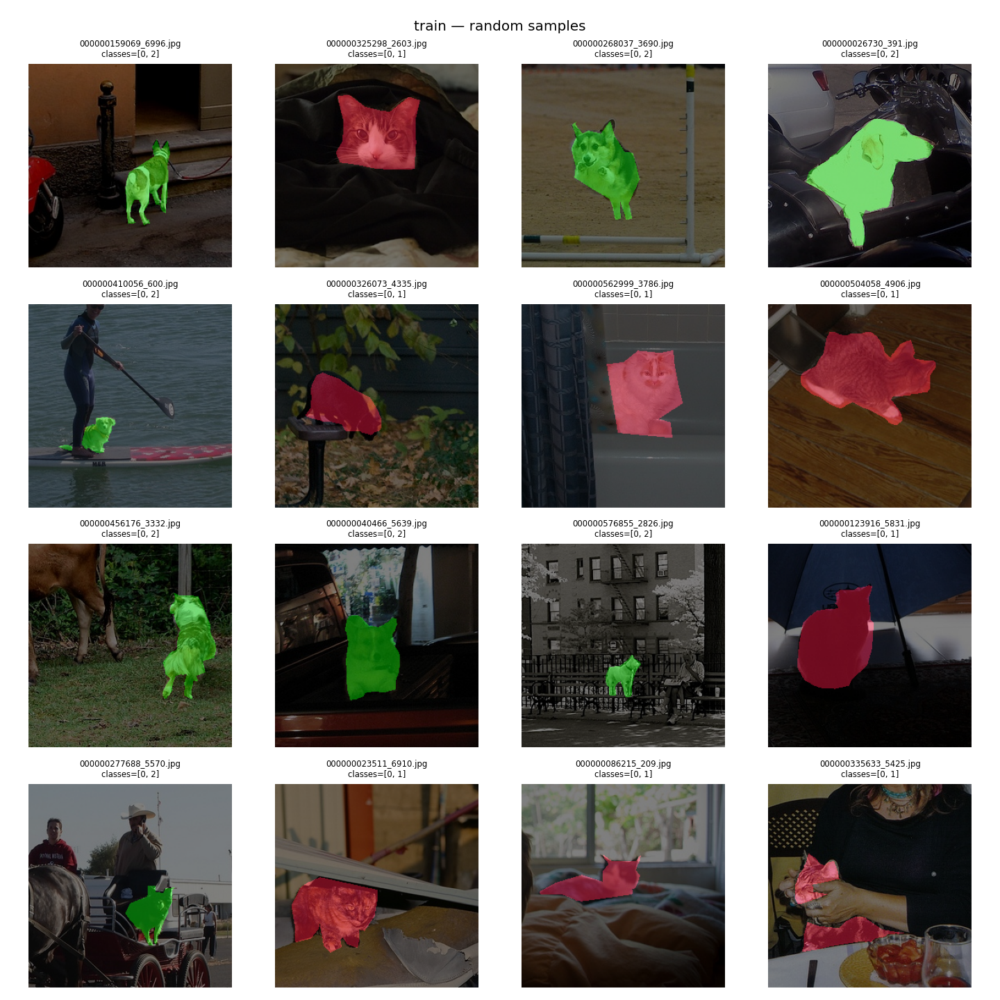

# Проект: мультиклассовая семантическая сегментация (mmsegmentation)

Отчёт по проекту обучения модели семантической сегментации на датасете **cat / dog**.

* **Задача:** мультиклассовая семантическая сегментация, 3 класса — `background`, `cat`, `dog`.
* **Целевая метрика:** **mDice > 0.75** на тестовом сабсете.
* **Вспомогательный код, ноутбуки и визуализации:** в сабмодуле [`practicum_work/`](practicum_work/).
  * EDA-ноутбук: [`practicum_work/eda.ipynb`](practicum_work/eda.ipynb).
* Оригинальный README фреймворка mmsegmentation сохранён в [`README_mmseg.md`](README_mmseg.md).

---

## Этап 1. Исследовательский анализ (EDA)

### Анализ качества данных

Датасет — изображения из COCO (по одному животному на картинку), маски размечены **грубо**
(«кляксой»), и часть разметки содержит **ошибки**. Качество оценивали в двух плоскостях:
грубые дефекты (по размеру/пустоте) и семантические ошибки (не тот объект / перепутан класс).

**Грубые дефекты.** Пустых масок, пропавших меток и гигантских масок нет. Найдены лишь
**2 вырожденные** маски в train (foreground < 0.1 % пикселей, фактически несколько пикселей):
`000000028253_7169`, `000000574769_0`.

**Семантические ошибки (основная проблема).** При постраничном просмотре train (раздел 6b
ноутбука) видно, что часть масок:
* лежит на **людях / мебели / фоне** — животного на маске нет;
* имеет **перепутанный класс** (кошка размечена как собака и наоборот).

**Точность контура — объективные замеры** (по всем маскам каждого сплита, скрипт в ноутбуке):

| метрика | train | test | трактовка |
|---|---:|---:|---|
| compactness (изрезанность контура) | 2.44 | 2.37 | форма масок одинаково «блобовая» |
| edge-alignment (граница по реальным краям) | 2.53 | **2.84** | **test размечен аккуратнее на ~13 %** |

Часть отставания train по edge-alignment объясняется именно семантическим мусором: маска не на
животном не совпадает с его краями и тянет метрику вниз.

#### Тактика чистки

1. **Test не трогаем** — это эталон, по которому считается mDice.
2. **Train — чиним семантику** доразметкой в CVAT: исправляем перепутанный класс cat↔dog;
   маски на людях/мебели/фоне перерисовываем на животное (или удаляем семпл, если животного нет);
   2 вырожденные маски перерисовываем/удаляем.
3. **Контур при доразметке** рисуем аккуратно, в стиле test (по краям животного). Это подтягивает
   train к более точному test и помогает метрике. Массово перетрассировать корректные маски не нужно —
   по compactness они уже на уровне test.
4. **Val** чистим по тем же правилам (для надёжного выбора модели); приоритет — train.

**Пайплайн доразметки:** `mmseg PNG → COCO/CVAT-XML (export) → правка в CVAT → CVAT 1.1 XML → mmseg PNG (import)`.
Скрипты: [`mmsegmentation_to_coco.py`](practicum_work/src/data/mmsegmentation_to_coco.py),
[`cvat_to_mmsegmentation.py`](practicum_work/src/data/cvat_to_mmsegmentation.py),
[`coco_to_mmsegmentation.py`](practicum_work/src/data/coco_to_mmsegmentation.py).

#### Результат доразметки (train)

В CVAT (app.cvat.ai с интерактивом SAM2) пересмотрены все 200 train-кадров.

| | значение |
|---|---:|
| оставлено в train | **179** |
| удалено из train (нет животного на кадре / пустая аннотация) | **21** (16 очищены, 5 удалены) |
| масок существенно перерисовано (IoU(old, new) < 0.85) | **60** |
| изменений класса cat↔dog | 0 |
| edge-alignment train: было → стало (test = 2.84) | **2.53 → 3.08** |

Список оставленных train-семплов: [`data/segmentation_dataset/splits/train.txt`](data/segmentation_dataset/splits/train.txt) — mmseg-датасет читает только их, исходные PNG исключённых остаются на диске нетронутыми (есть бэкап в `data/labels_backup_train/`).

**Примеры «до / после»** (вырожденные/смещённые маски перерисованы аккуратно по животному):



**Примеры исключённых из train** (на кадре нет cat/dog — маски очищены в CVAT):



> *Side-effect:* edge-alignment train (3.08) теперь чуть выше test (2.84) — SAM2 местами рисует слишком точно по сравнению с грубой test-разметкой. Разрыв небольшой (~8 %), потенциальный отрицательный эффект на mDice невелик и компенсируется устранением семантического мусора. Перепроверим на тесте по результатам обучения.

### EDA

Полный анализ — в ноутбуке [`practicum_work/eda.ipynb`](practicum_work/eda.ipynb).
Ключевые результаты:

**Размеры.** Все 440 изображений и масок — ровно **256×256**. Разброса нет, поэтому resize/кропы
в аугментациях можно не усложнять. Сплиты: train = 200, val = 120, test = 120.

**Сбалансированность.**
* *Pixel-level* — сильный перекос в фон: background ≈ 90 %, cat ≈ 5 %, dog ≈ 4 %.
* *Image-level* — идеальный баланс: ровно один foreground-класс на картинку, 50/50 cat/dog
  (train 100/100, val 60/60, test 60/60). Картинок с обоими классами или без животного нет.



**Нормализация (train, диапазон 0–255):** mean = `[118.1, 111.1, 98.7]`, std = `[67.3, 67.0, 69.0]`.

**Примеры семплов с наложенной маской** (красный — cat, зелёный — dog):



**Выводы для обучения.** Перекос в фон → лосс с защитой от дисбаланса (**Dice** или **CE + Dice**,
опционально class weights). Целевая метрика mDice к такому перекосу устойчивее, чем accuracy/mIoU.

---

## Этап 2. Формирование первичных гипотез

### Логика выбора модели — одна гипотеза

Учебник Спринта 2 даёт два чётких указания, которые сходятся на одной модели для
наших данных:

1. **Урок «DeepLab vs UNet»:** при наличии подходящих предобученных весов
   нужно использовать DeepLab (он на ResNet с богатым ImageNet-pretrain); UNet
   уместен там, где сильного pretrain нет (медицина и т. п.).
2. **Урок «Современные модификации» — таблица «какая модель куда»:**
   - DeepLabV3+ → умный дом, город, ImageNet/COCO-классы.
   - UNet+DeepLab → рыбки в океанариуме, птицы в небе, черви на земле —
     **не-ImageNet домены**.

Наши классы — `cat` и `dog`, **прямые ImageNet/COCO классы**, чьи фичи backbone
уже видел при предобучении. Поэтому **одна стартовая гипотеза — DeepLabV3+ R50-d8**
(`open-mmlab://resnet50_v1c` ImageNet pretrain).

UNet «с нуля» **сознательно не запускаем как бейзлайн**: учебник прямо говорит,
что он проиграет на этих классах, а ~40 мин GPU-бюджета лучше потратить на
эксперименты Этапа 3. Конфиг UNet всё же
[оставлен в репо](configs/unet_practice/unet-s5-d16_fcn_1xb16-practice_dataset-256x256.py)
как зафиксированная альтернатива (можно запустить при желании).

### Почему именно R50-d8 (а не R101 или R18)

На странице с замерами из урока — те же R50/R101 на той же ВМ, что и у нас:

| модель | время/итер (с) |
|---|---:|
| deeplabv3plus_r18-d8 | 0.020 |
| **deeplabv3plus_r50-d8** | **0.077** |
| deeplabv3plus_r101-d8 | 0.112 |
| deeplabv3plus_r101-d16-mg124 | 0.040 |

R50-d8 — золотая середина: сильнее R18 (больше pretrained-капасити) и заметно
быстрее R101-d8. Более тяжёлые варианты (R101 + multi-grid) попадают в
**Эксперимент 3** (см. ниже).

### Структура кода (по конвенции mmsegmentation)

* Датасет-класс [`mmseg/datasets/practice_dataset.py`](mmseg/datasets/practice_dataset.py) —
  `PracticeDataset(BaseSegDataset)`, классы `("background","cat","dog")`,
  палитра `[[0,0,0],[255,0,0],[0,255,0]]`. Зарегистрирован в
  [`mmseg/datasets/__init__.py`](mmseg/datasets/__init__.py) и
  [`mmseg/utils/class_names.py`](mmseg/utils/class_names.py).
* Базовый dataset-конфиг: [`configs/_base_/datasets/practice_dataset.py`](configs/_base_/datasets/practice_dataset.py) —
  читает очищенные стемы из [`splits/train.txt`](data/segmentation_dataset/splits/train.txt) (179 семплов).
* Базовый schedule: [`configs/_base_/schedules/practice_schedule.py`](configs/_base_/schedules/practice_schedule.py) —
  `EpochBasedTrainLoop`, 100 эпох, SGD 0.01 PolyLR, чекпоинт по лучшему `mDice`.

### Стартовая гипотеза — DeepLabV3+ ResNet50-d8

**Описание гипотезы.** Главный кандидат — DeepLabV3+ с бэкбоном **ResNet50_v1c**
(ImageNet pretrain, `open-mmlab://resnet50_v1c`). Декодер —
`DepthwiseSeparableASPPHead` (многомасштабный контекст из ASPP + decoder со skip
к low-level features из stage-1), вспомогательная FCN-голова на stage-3 для
доп. контроля обучения.

**Обоснование выбора по EDA + публичным результатам.**
- *Pretrained backbone* — cat/dog в ImageNet → backbone уже знает эти классы,
  быстро сойдётся на 179 семплах.
- *ASPP* — даёт мультимасштабный контекст, важен для крупных силуэтов
  животных при коротком расстоянии (см. урок: «крупные объекты лучше с
  глобальным контекстом»).
- *Decoder DeepLabV3+* — восстанавливает разрешение через skip с low-level,
  без чего модель плохо ловила бы тонкие детали (лапы, хвост).

**Параметры обучения:**

| параметр | значение | обоснование |
|---|---|---|
| вход | 256×256 (нативный) | EDA: все изображения уже 256×256 |
| лосс | **CE + Dice** (1.0 + 1.0) | CE даёт пиксельные градиенты, Dice устойчив к перекосу 90 % фона |
| метрика | mDice (через `IoUMetric`) | целевая метрика проекта |
| нормализация | mean = [118.1, 111.1, 98.7], std = [67.3, 67.0, 69.0] | посчитано на чистом train (EDA) |
| аугментации | RandomFlip + лёгкий PhotoMetricDistortion | минимум — усиление в Эксперименте 1 |
| optimizer | SGD 0.01, momentum 0.9, WD 5e-4 | стандарт mmseg для DeepLab |
| schedule | PolyLR, **100 эпох**, val каждые 5 эпох | по уроку; ~12 итер/эпоху при batch=16 |
| batch | 16 (train), 1 (val/test) | по уроку «можно больший batch» для 256×256 |
| данные train | 179 семплов из [`splits/train.txt`](data/segmentation_dataset/splits/train.txt) | очищенный после CVAT датасет |
| ckpt selection | `save_best="mDice"` | автоматически сохраняем лучший по метрике |
| логирование | `Visualizer` с `LocalVisBackend` + **`ClearMLVisBackend`**, project `YaPracticum` | по примеру урока |

**Результаты обучения.**
* Конфиг: [`configs/deeplabv3plus_practice/deeplabv3plus_r50-d8_1xb16-practice_dataset-256x256.py`](configs/deeplabv3plus_practice/deeplabv3plus_r50-d8_1xb16-practice_dataset-256x256.py)
* ClearML: <!-- TODO: вставить публичную ссылку после запуска на ВМ -->

**Анализ качества.** <!-- TODO: после обучения — приложить метрики (mDice/per-class Dice), top/worst примеры через practicum_work/src/analysis/per_image_dice.py -->

### Запуск на ВМ

ВМ Яндекс Практикума: Tesla T4 / Ubuntu / CUDA 11.8 / Python 3.10. Версии
зафиксированы по уроку «Получение ВМ»: PyTorch 2.0.0+cu118, mmcv==2.1.0,
numpy==1.26.4, clearml==2.0.2 (mmcv≥2.2 не поддерживается mmsegmentation; numpy 2.x
ломает mmseg).

```bash
# 0) подключиться к ВМ по SSH (рекомендуем VSCode Remote-SSH из урока)
ssh -i ~/.ssh/user_key ubuntu@<vm-ip>

# 1) перенести код на ВМ: git clone репозитория проекта
git clone git@github.com:<your>/nn_cv_sprint2_full.git
cd nn_cv_sprint2_full
# датасет передаём отдельно (с локалки, ~32 MB):
#   scp -i ~/.ssh/user_key -r data/segmentation_dataset ubuntu@<vm-ip>:~/nn_cv_sprint2_full/data/

# 2) создать и активировать venv (рекомендация урока)
python3.10 -m venv ~/practicum_venv
source ~/practicum_venv/bin/activate

# 3) установить весь стек (точные версии по уроку: torch 2.0.0+cu118, mmcv==2.1.0)
bash practicum_work/setup_vm.sh
clearml-init                       # вставить creds из локального keys.txt

# 4) проверка готовности конфига (не запускает обучение)
python practicum_work/sanity_check.py configs/deeplabv3plus_practice/deeplabv3plus_r50-d8_1xb16-practice_dataset-256x256.py

# 5) запуск обучения бейзлайна (~30-45 мин на одном T4 по бенчмарку урока)
python tools/train.py configs/deeplabv3plus_practice/deeplabv3plus_r50-d8_1xb16-practice_dataset-256x256.py

# 6) анализ качества лучшего чекпойнта на test
python practicum_work/src/analysis/per_image_dice.py \
    --config configs/deeplabv3plus_practice/deeplabv3plus_r50-d8_1xb16-practice_dataset-256x256.py \
    --checkpoint work_dirs/deeplabv3plus_r50-d8_1xb16-practice_dataset-256x256/best_mDice_epoch_*.pth \
    --split test --out practicum_work/supplementary/viz/test_deeplab --n 5
```

**Альтернатива через ноутбук-оркестратор** ([`practicum_work/train.ipynb`](practicum_work/train.ipynb)):
шаги 0–3 (SSH + venv + setup + clearml-init) делаются один раз в терминале ВМ,
затем открыть ноутбук в VSCode Remote-SSH и выбрать kernel из созданного venv —
ячейки выполняют sanity-check, обучение и анализ. ClearML-ссылка печатается в
первых строках вывода ячейки обучения.

## Этап 3. Эксперименты по улучшению качества

Каждый эксперимент меняет **одну** вещь относительно бейзлайна (DeepLabV3+ R50-d8),
чтобы прирост можно было приписать конкретному изменению. Все остальные параметры
наследуются от базового конфига Этапа 2.

### Эксперимент 1 — усиленные аугментации

**Описание эксперимента.** На 179 семплах модель легко переобучается. Урок 7
предлагает набор `RandomRotFlip` + усиленный `PhotoMetricDistortion` +
`RandomCutOut`. Этот эксперимент проверяет, насколько такие аугментации
повышают mDice на test (где грубая разметка + шум).

**Результаты обучения.** <!-- TODO: конфиг + ClearML ссылка после запуска -->

**Анализ качества.** <!-- TODO: метрики, примеры -->

### Эксперимент 2 — баланс лосса CE:Dice = 1:3

**Описание эксперимента.** Бейзлайн использует CE+Dice 1:1. Готовые
mmseg-конфиги для несбалансированных датасетов (например, `chase_db1` с
дисбалансом ~10:1) используют **CE:Dice = 1:3** — Dice весит больше, чтобы
компенсировать перекос. У нас 90:10 — даже сильнее. Этот эксперимент
проверяет, поможет ли увеличить вес Dice.

**Результаты обучения.** <!-- TODO: конфиг + ClearML ссылка после запуска -->

**Анализ качества.** <!-- TODO: метрики, примеры -->

### Эксперимент 3 — более тяжёлый backbone R101 + multi-grid

**Описание эксперимента.** По бенчмарку из урока, `deeplabv3plus_r101-d16-mg124`
**быстрее** R50-d8 (0.040 vs 0.077 с/итер) при существенно более ёмком
ImageNet-pretrained backbone и явном механизме улучшения глобального
контекста (multi-grid). Этот эксперимент проверяет, можно ли «бесплатно»
поднять метрику более глубоким бэкбоном.

**Результаты обучения.** <!-- TODO: конфиг + ClearML ссылка после запуска -->

**Анализ качества.** <!-- TODO: метрики, примеры -->

## Этап 4. Заключение и выбор лучшего эксперимента

<!-- TODO -->

## Этап 5. Документация кода

<!-- TODO -->
